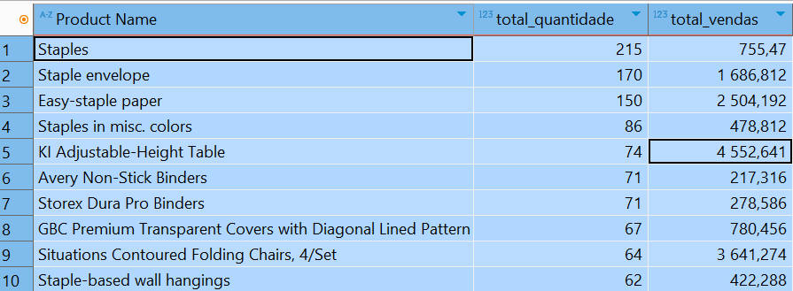

Qual o produto com demanda?
SELECT "Product Name", SUM("Quantity") AS total_quantidade, SUM("Sales") AS total_vendas
FROM "Superstore_dados_limpos"
GROUP BY "Product Name"
ORDER BY total_quantidade DESC
LIMIT 10;

Qua los produtos menos vendidos?
SELECT
    "Product ID",
    "Product Name",
    SUM("Quantity") AS "Quantidade Vendida"
FROM
    "Superstore_dados_limpos"
GROUP BY
    "Product ID",
    "Product Name"
ORDER BY
    "Quantidade Vendida" ASC
LIMIT 10;

Qual os melhores compradores?
SELECT
    "Customer ID",
    "Customer Name",
    SUM("Sales") AS "Total Comprado"
FROM
    "Superstore_dados_limpos"
GROUP BY
    "Customer ID",
    "Customer Name"
ORDER BY
    "Total Comprado" desc
LIMIT 10;

Vendas por Mês e por Ano

SELECT
    EXTRACT(YEAR FROM "Order Date") AS "Ano",
    EXTRACT(MONTH FROM "Order Date") AS "Mês",
    SUM("Sales") AS "Total de Vendas"
FROM
    "Superstore_dados_limpos"
WHERE
    EXTRACT(YEAR FROM "Order Date") = 2015
GROUP BY
    EXTRACT(YEAR FROM "Order Date"),
    EXTRACT(MONTH FROM "Order Date")
ORDER BY
    "Mês" ASC;

SELECT
    EXTRACT(YEAR FROM "Order Date") AS "Ano",
    EXTRACT(MONTH FROM "Order Date") AS "Mês",
    SUM("Sales") AS "Total de Vendas"
FROM
    "Superstore_dados_limpos"
WHERE
    EXTRACT(YEAR FROM "Order Date") = 2016
GROUP BY
    EXTRACT(YEAR FROM "Order Date"),
    EXTRACT(MONTH FROM "Order Date")
ORDER BY
    "Mês" ASC;

SELECT
    EXTRACT(YEAR FROM "Order Date") AS "Ano",
    EXTRACT(MONTH FROM "Order Date") AS "Mês",
    SUM("Sales") AS "Total de Vendas"
FROM
    "Superstore_dados_limpos"
WHERE
    EXTRACT(YEAR FROM "Order Date") = 2016
GROUP BY
    EXTRACT(YEAR FROM "Order Date"),
    EXTRACT(MONTH FROM "Order Date")
ORDER BY
    "Mês" ASC;

